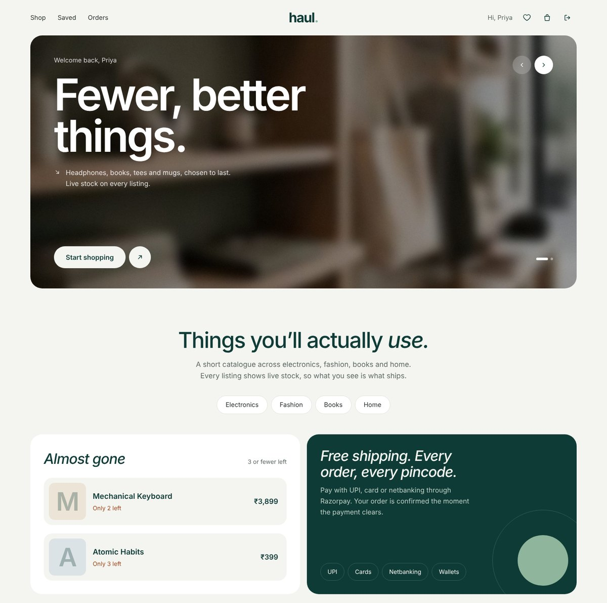
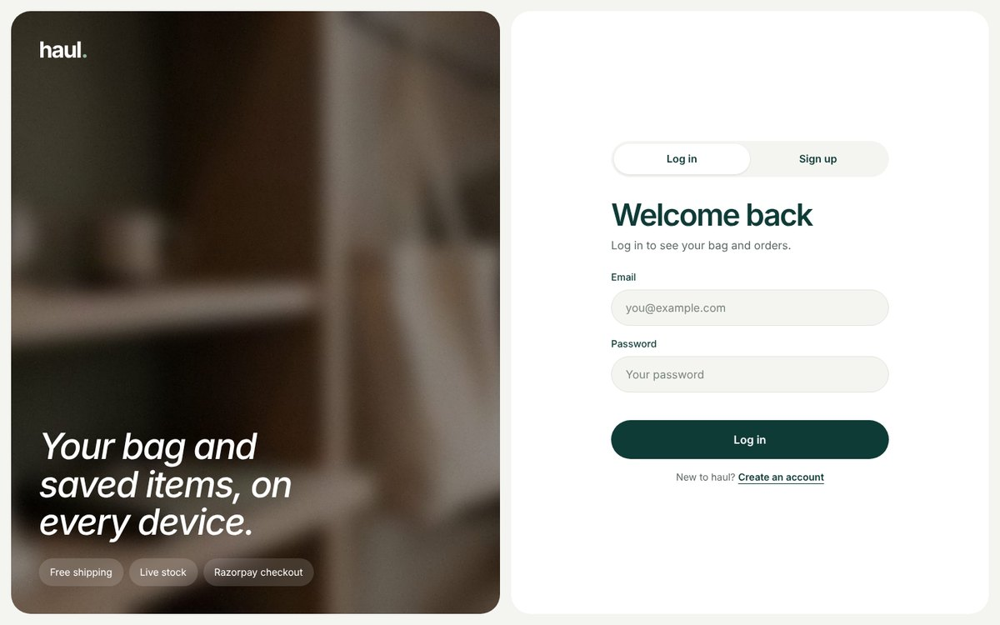
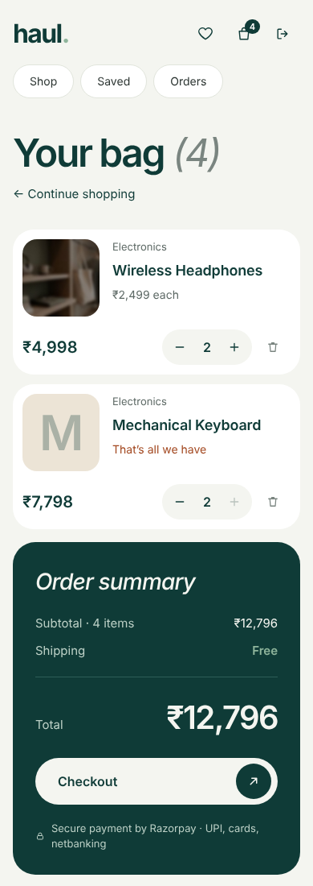

<div align="center">

# Haul

**An online store for everyday things.**

Browse with live stock counts, save favourites, keep a bag that follows you across devices,
and check out in under a minute with UPI, cards or netbanking.

[](https://render.com/deploy?repo=https://github.com/Priyansh10ff/ShopKart_SST)
&nbsp;
[](https://vercel.com/new/clone?repository-url=https%3A%2F%2Fgithub.com%2FPriyansh10ff%2FShopKart_SST&root-directory=frontend&env=VITE_API_URL&envDescription=Base%20URL%20of%20the%20haul%20API%20on%20Render)


<!-- Live demo: add your Vercel URL here after deploying -->



</div>

---

## What it is

haul is a small, focused web store for headphones, books, tees, mugs and other everyday things. Shoppers sign up, browse a catalogue that always shows how many units are left, save items for later, and pay through Razorpay. Prices, totals and stock are decided by the server, and an order only counts as paid once the payment signature has been verified.

It was built as ShopKart, a MERN project at Scaler School of Technology, and renamed haul with the redesign. The repository keeps its original name.

## Features

| | |
|---|---|
| **Accounts** | Sign up, log in and log out. Sessions live in an HTTP-only cookie for 7 days. Emails are case-insensitive. |
| **Catalogue** | Search by name, filter by category with shareable links (`/products?category=Books`), live stock on every card, "Almost gone" list for low-stock items. |
| **Saved items** | Heart any product from a card or its page; everything saved is on the Saved page. |
| **Bag** | Stored on the server, so it is the same on every device. Quantities are capped at stock, and products removed from the store drop out automatically. |
| **Checkout** | One address form with Indian mobile and pincode validation, then Razorpay (UPI, cards, netbanking, wallets). The total is recalculated on the server. |
| **Orders** | Order history, order details and a confirmation screen after payment. Stock is reduced exactly once per paid order. |
| **Design** | Sage and teal palette, Instrument Sans, rounded cards and pill controls, loading skeletons and empty states. Works from 390 px phones to wide desktops. |

<table>
  <tr>
    <td width="68%"></td>
    <td width="32%"></td>
  </tr>
</table>

## How a purchase works

1. The shopper adds items to their bag. The server checks each quantity against stock.
2. At checkout the browser sends **only the shipping address**. The server rebuilds the order from the bag and the live catalogue, creates a pending order and a Razorpay order for that exact amount.
3. Razorpay Checkout opens and the shopper pays.
4. The browser forwards Razorpay's result to the server, which checks the HMAC-SHA256 signature against the order ID it stored.
5. Only then is the order marked paid, stock is reduced (never below zero), and the bag is emptied. A duplicate verification can't reduce stock twice.

A failed or abandoned payment leaves the bag untouched.

## Tech stack

| Layer | Choice |
|---|---|
| Frontend | React 19, Vite 8, Tailwind CSS 4, React Router 7, Axios |
| Backend | Node.js 20+, Express 5 |
| Database | MongoDB with Mongoose 9 |
| Auth | JWT in an HTTP-only cookie, bcrypt |
| Payments | Razorpay Orders API + Checkout |
| Hosting | Vercel (frontend), Render (API), MongoDB Atlas |

## Getting started

### Prerequisites

- Node.js 20 or newer
- A MongoDB database ([Atlas free tier](https://www.mongodb.com/atlas) works)
- Optional: Razorpay test keys ([dashboard](https://dashboard.razorpay.com) → Test Mode → API Keys). Without them everything runs except payment

### Run locally

```bash
git clone https://github.com/Priyansh10ff/ShopKart_SST.git
cd ShopKart_SST

# API → http://localhost:8001
cd backend
cp .env.example .env        # fill in MONGO_URL and JWT_SECRET (Razorpay keys optional)
npm install
npm run dev

# Web app → http://localhost:5173 (second terminal)
cd frontend
cp .env.example .env        # VITE_API_URL=http://localhost:8001
npm install
npm run dev
```

### Add products

A new database has no products and there is no admin screen yet, so add them through the API:

```bash
curl -X POST http://localhost:8001/products \
  -H "Content-Type: application/json" \
  -d '{"name":"Wireless Headphones","description":"Over-ear, 30h battery","price":2499,"category":"Electronics","image":"https://example.com/headphones.jpg","stock":10}'
```

Use the categories `Electronics`, `Fashion`, `Books` or `Home` so products appear under the filters. `image` must be a public image URL.

### Test a payment

With `rzp_test_` keys, pay with Razorpay's [test cards or UPI IDs](https://razorpay.com/docs/payments/payments/test-card-details/). No real money moves.

## Environment variables

**`backend/.env`**

| Key | Required | Description |
|---|---|---|
| `NODE_ENV` | | `production` turns on cross-site cookies (`SameSite=None; Secure`) |
| `PORT` | | API port, default `8001`. Render sets it automatically |
| `MONGO_URL` | ✓ | MongoDB connection string |
| `JWT_SECRET` | ✓ | Long random string used to sign login tokens |
| `CLIENT_URL` | ✓ in production | Allowed frontend origin(s) for CORS, comma-separated |
| `RAZORPAY_KEY_ID` | | Razorpay key ID. Optional, see below |
| `RAZORPAY_KEY_SECRET` | | Razorpay key secret. Optional, see below |

**Running without payments:** leave both Razorpay keys unset and the whole store still works (accounts, catalogue, saved items, bag, orders history). Only the final Pay step is disabled: checkout replies *"Payments are not configured on the server yet."* Add both keys and restart to turn payments on.

**`frontend/.env`**

| Key | Required | Description |
|---|---|---|
| `VITE_API_URL` | ✓ in production | Base URL of the API. Built into the bundle, so redeploy after changing it |

## Deployment

| Piece | Platform | Notes |
|---|---|---|
| API | Render | `render.yaml` Blueprint: root `backend`, `npm install`, `npm start`, health check `/health`; you enter `MONGO_URL`, `JWT_SECRET`, `CLIENT_URL`. Razorpay keys optional |
| Web app | Vercel | Root `frontend`, framework Vite, `VITE_API_URL` = Render URL. `vercel.json` handles SPA routes and caching |
| Database | MongoDB Atlas | Allow network access from `0.0.0.0/0` (Render free tier has no fixed IP) |

1. Deploy the API on Render (New → Blueprint → this repo) and check `https://<service>.onrender.com/health`.
2. Deploy the frontend on Vercel with `VITE_API_URL` set to the Render URL.
3. Set `CLIENT_URL` on Render to the exact Vercel URL.

Full walkthrough, custom domains and a pre-launch checklist: [docs/DEPLOYMENT.md](docs/DEPLOYMENT.md).

## Scripts

| Location | Command | Does |
|---|---|---|
| `backend` | `npm run dev` | API with auto-reload (nodemon) |
| `backend` | `npm start` | API for production |
| `frontend` | `npm run dev` | Vite dev server |
| `frontend` | `npm run build` | Production build to `dist/` |
| `frontend` | `npm run preview` | Serve the production build locally |
| `frontend` | `npm run lint` | ESLint |

## Project structure

```text
ShopKart_SST/
├── backend/            Express API
│   ├── controllers/    Auth, products, cart, wishlist, orders and payments
│   ├── middlewares/    JWT cookie auth
│   ├── models/         Customer, Product, Order
│   ├── routes/
│   └── index.js        App setup, CORS, /health, DB connect → listen
├── frontend/           React SPA
│   └── src/
│       ├── components/ Layout, Navbar, ProductCard, ProductImage, AuthLayout…
│       ├── context/    Auth and cart state
│       ├── pages/      Home, Products, ProductDetails, Cart, Checkout, Orders, Saved, auth
│       └── lib/        Formatting helpers
├── docs/               Product, PRD, technical and deployment docs
└── render.yaml         Render Blueprint for the API
```

## Security

- Passwords hashed with bcrypt and never returned by the API.
- Session JWT in an `HttpOnly` cookie; `Secure` and `SameSite=None` in production.
- CORS limited to `CLIENT_URL`; JSON bodies capped at 100 kB.
- Prices and totals are always computed on the server; payments are verified with a timing-safe HMAC check.
- Every cart, saved-item and order query is scoped to the logged-in customer.
- Search input is escaped before it reaches MongoDB.

## Known limitations

- `POST /products` is not protected yet. Keep the API URL private until admin-only access ships.
- No Razorpay webhook: if a shopper pays and closes the tab before verification, the order stays pending. Reconcile from the Razorpay dashboard.
- On the default `vercel.app` + `onrender.com` domains, Safari blocks the cross-site login cookie. Use one custom domain for both (see [DEPLOYMENT.md](docs/DEPLOYMENT.md#7-custom-domains-recommended)).
- Render's free instance sleeps when idle; the first request after a pause takes 30 to 50 seconds.

## Documentation

| Doc | Contents |
|---|---|
| [PRODUCT.md](docs/PRODUCT.md) | What haul is, who it is for, how it works |
| [PRD.md](docs/PRD.md) | Goals, user stories, acceptance criteria, release plan |
| [TECHNICAL.md](docs/TECHNICAL.md) | Architecture, data model, payment flow, full API reference |
| [DEPLOYMENT.md](docs/DEPLOYMENT.md) | Step-by-step deploy, custom domains, troubleshooting |

## Author

**Priyansh Dugar** · [GitHub](https://github.com/Priyansh10ff) · [LinkedIn](https://www.linkedin.com/in/priyansh-dugar-709333363/) · [X](https://x.com/_Priyansh_10)
